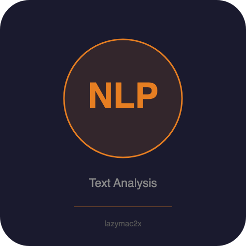

<p align="center"></p>

[](https://lazymac2x.github.io/lazymac-api-store/) [](https://coindany.gumroad.com/) [](https://mcpize.com/mcp/text-analysis-api)

# text-analysis-api

[](https://www.npmjs.com/package/@lazymac/mcp)
[](https://smithery.ai/server/lazymac/mcp)
[](https://coindany.gumroad.com/l/zlewvz)
[](https://api.lazy-mac.com)

> 🚀 Want all 42 lazymac tools through ONE MCP install? `npx -y @lazymac/mcp` · [Pro $29/mo](https://coindany.gumroad.com/l/zlewvz) for unlimited calls.

Algorithmic text/NLP analysis REST API and MCP server. All processing is rule-based — no external AI APIs or ML models required.

## Features

- **Sentiment analysis** — positive/negative/neutral scoring with negation & intensifier handling
- **Readability scores** — Flesch-Kincaid Grade, Flesch Reading Ease, Coleman-Liau, ARI
- **Keyword extraction** — TF-based scoring with stop word removal
- **Language detection** — character frequency analysis (EN, KO, JA, ZH, ES, FR, DE)
- **Text statistics** — word/sentence/paragraph counts, avg lengths, reading & speaking time
- **Profanity detection** — basic word list check
- **Summarization** — extractive, sentence-scoring approach
- **MCP server** — stdio-based Model Context Protocol integration

## Quick Start

```bash
npm install
npm start          # REST API on port 4600
npm run mcp        # MCP server (stdio)
```

## API Endpoints

All POST endpoints accept `{ "text": "..." }` as JSON body.

| Endpoint | Description |
|---|---|
| `GET /health` | Health check |
| `POST /api/v1/sentiment` | Sentiment analysis |
| `POST /api/v1/readability` | Readability scores |
| `POST /api/v1/keywords` | Keyword extraction |
| `POST /api/v1/language` | Language detection |
| `POST /api/v1/stats` | Text statistics |
| `POST /api/v1/analyze` | Full analysis (all above) |

## Example

```bash
curl -X POST http://localhost:4600/api/v1/analyze \
  -H "Content-Type: application/json" \
  -d '{"text": "This is a wonderful and amazing product. I really love using it every day!"}'
```

## MCP Integration

Add to your Claude Desktop or MCP client config:

```json
{
  "mcpServers": {
    "text-analysis": {
      "command": "node",
      "args": ["/path/to/text-analysis-api/src/mcp-server.js"]
    }
  }
}
```

### MCP Tools

`analyze_sentiment`, `analyze_readability`, `extract_keywords`, `detect_language`, `analyze_stats`, `detect_profanity`, `summarize_text`, `analyze_all`

## Docker

```bash
docker build -t text-analysis-api .
docker run -p 4600:4600 text-analysis-api
```

## License

MIT
